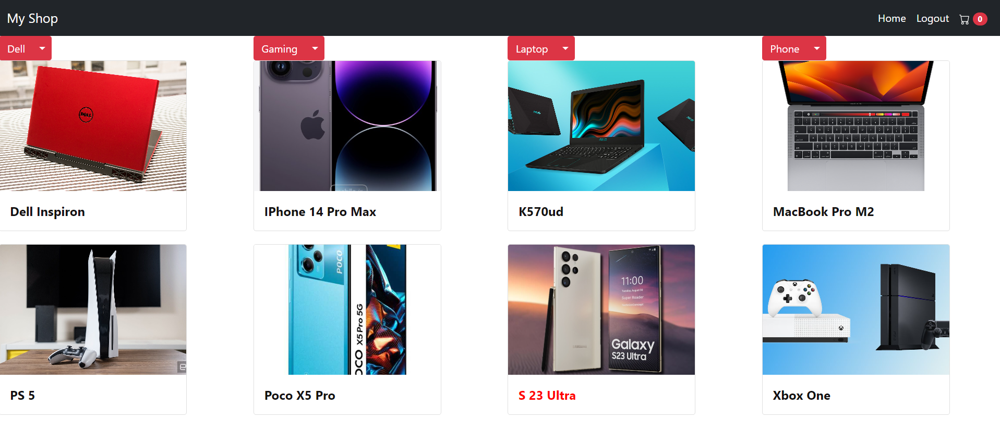

# Online Shop with Django 4
This is an e-commerce project written in Django 4 using the MVT (Model-View-Template) architecture. The project includes a custom user model, product and category models, a cart model, and an order model.



### Installation
1. Clone the repository:

```
git clone https://github.com/Amircroo7/E-commerce-with-django.git
```
2. Create and activate a virtual environment:
```
python -m venv venv
source venv/bin/activate
```
3. Install the project dependencies:
```
pip install -r requirements.txt
```
4. Create the database tables:
```
python manage.py migrate
```
5. (Optional) Create a superuser:
```
python manage.py createsuperuser
```
6. Start the development server:
```
python manage.py runserver
```


Thanks to [Amirbig](https://github.com/amirbigg/) For [Mongard](https://www.mongard.ir/) and django courses.

[Related Course](https://www.mongard.ir/courses/django-shop/)
